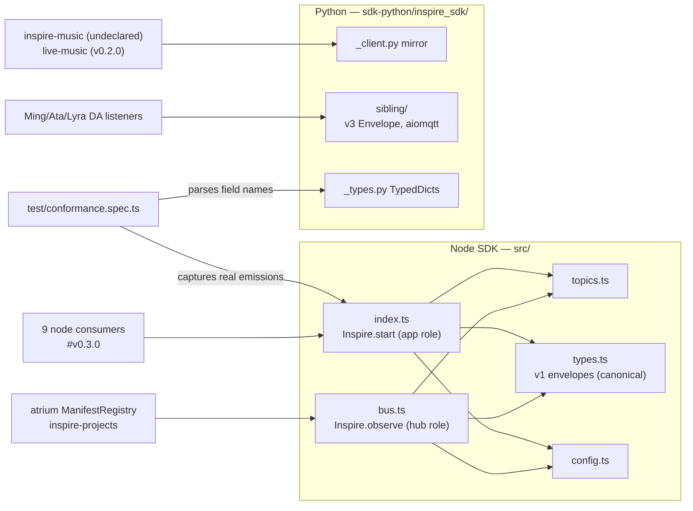

# Architecture — inspire-sdk

> Hand-audited against the working tree on 2026-08-15. This is a LIBRARY (no runtime process of its own); claims carry `file:line` evidence and a confidence tag. Shared technology background: [MQTT bus](https://vitara-rv.tail7e250a.ts.net:11443/docs/tech/mqtt-bus.html) · [Bun + TypeScript](https://vitara-rv.tail7e250a.ts.net:11443/docs/tech/bun-typescript.html) · [Python components](https://vitara-rv.tail7e250a.ts.net:11443/docs/tech/python-components.html)

## Position in the suite

| | |
|---|---|
| Role | The suite's shared bus SDK: wire contract + client library for the inspire-* app bus, plus the Python-only DA sibling layer. Owner of `docs/BUS.md`, the fleet-bus front door (high) |
| Runs as | Library only — linked into consumers; no service, no port, no registry entry (high) |
| Consumers | 9 node repos pin `github:amaitre/inspire-sdk#v0.3.0` (atrium, automation, contacts, creativity, financial, fleet-test, investment, quant, support); inspire-projects and inspire-music import it undeclared; inspire-live-music pins python `v0.2.0` — a known skew (suite-facts 2026-08-15) (high) |
| Languages | Node/TS root (`src/`, CJS via `tsc`) + Python mirror (`sdk-python/inspire_sdk/`), one version, one git tag for both (high) |
| Tests | bun test (6 files, incl. Node↔Python conformance) + pytest against a real spawned Mosquitto (`sdk-python/tests/conftest.py`) (high) |
| CI | `.github/workflows/ci.yml` — node + python jobs; the only inspire-* repo with CI (high) |

## 1. Stack composition

- node client: `mqtt` 5.x over MQTT 3.1.1 (`src/index.ts:517` protocolVersion 4) (high)
- python client: paho-mqtt >=2.0 sync (`sdk-python/inspire_sdk/_client.py`); sibling layer aiomqtt async as `[sibling]` optional extra (`sdk-python/pyproject.toml`) (high)
- config: smol-toml (node) / tomllib+tomli (python) parse `.inspire/config.toml`, walked up from cwd (`src/config.ts`, `_config.py`) (high)
- test brokers: in-process aedes on a random port for node (`test/conformance.spec.ts:50-68`); a real Mosquitto spawned per pytest session for python — retain/LWT semantics tested against the production broker implementation (high)
- python floor is 3.10 for the Jetson (Lyra); tomli/typing_extensions backports are conditional deps (`pyproject.toml`) (high)

## 2. Architecture summary

One repo, two roles, two languages. The **wire contract** lives in `src/types.ts` (v1 envelopes — one interface per topic: Presence, Heartbeat, Status, Log, Command, CapabilityManifest, RpcRequest/Response) and `src/topics.ts` (the single source of topic strings, `inspire/<kind>/<slug>/<nodeId>`); atrium re-exports these instead of keeping a copy (`src/types.ts:2-7`) (high).

The **app role** (`Inspire.start()`, `src/index.ts`) is what an inspire-* app links: connect with an LWT that clears retained presence on crash (`index.ts:523-528`), publish retained PresenceMsg, run a 10s heartbeat (deliberately no immediate first beat — consumers use a freshness window, `index.ts:218-220`), serve fire-and-forget commands and request/response RPC verbs, and publish a retained capability manifest that republishes on every `onCall()` registration (`index.ts:316-326`) so discovery is a single wildcard subscribe (high).

The **consumer/hub role** (`Inspire.observe()`, `src/bus.ts`) subscribes all four wildcard families plus its own RPC reply channel, demuxes topics into typed events (`bus.ts:281-323`), and can `call()` any app. It exists because atrium and inspire-projects each hand-rolled ~280 lines of this state machine; it was extracted into the SDK once, event-signature-compatible with atrium's InspireBus (`bus.ts:10-13`) (high).

The **Python mirror** re-implements the app role byte-for-byte ("atrium cannot tell which language an app uses", `_client.py` docstring), and additionally owns `inspire_sdk.sibling` — the DA-to-DA layer with a different wire contract entirely: a single generic v3 `Envelope` discriminated by `type`, aiomqtt/async, configured from `sibling.yaml` rather than `.inspire/config.toml`, hub-and-spoke on Ming's broker rather than the federated app-bus. No node sibling implementation exists (`docs/BUS.md` §1) (high).

## 3. Component diagram

## 4. Primary flow — app lifecycle + RPC

`Inspire.start({slug, version})` → resolve broker (opts → `INSPIRE_BROKER_HOST/PORT` → `BROKER_HOST/PORT` → `.inspire/config.toml` walk-up → `127.0.0.1:1883`; identical chain in both languages since 2026-07-14, `src/config.ts` / `_config.py`) → connect with LWT → retained presence → heartbeat → subscribe cmd + rpc topics → retained manifest (high). RPC call: caller lazily subscribes its reply wildcard `inspire/rpc/_reply/<replyTo>/+` **before** publishing (`index.ts:360`, `bus.ts:256`), correlates on a pid-based time-free `corr_id` (`index.ts:73-77`), and fails closed on timeout — 8s app-client default (`index.ts:70`), 20s observer/hub (`bus.ts:40`). Unknown verb → `UNKNOWN_VERB`; a throwing handler → `HANDLER_ERROR` response, never a hang (`index.ts:287-314`) (high). Graceful `stop()` clears retained **manifest first, then presence** — presence-first would leave a dead-but-advertised window (`index.ts:452-474`, comment explains the invariant; python matches). Offline stop skips retained-clears entirely and lets the LWT do it; LWT covers presence ONLY, so a crash leaves a stale retained manifest for the hub to evict on presence-null (high).

## 5. Design patterns identified

- **Emissions-as-contract conformance**: the cross-language test doesn't compare code — it captures what Node actually publishes over a live broker and diffs field sets against Python's parsed TypedDicts (`conformance.spec.ts:102-137`). Structural drift in either language fails CI (high)
- **Single-source topics**: every topic string is built by `topics.ts` constructors; consumers are told to import them rather than re-declare (`topics.ts:1-6`) (high)
- **Retained-message discovery**: presence, status, and manifest are retained, so a new observer gets the full fleet picture instantly with zero request traffic (high)
- **Graceful-vs-crash asymmetry as design**: LWT (crash) handles presence only; graceful stop handles manifest+presence in a deliberate order — the stale-manifest window on crash is a documented, hub-compensated tradeoff, not an oversight (`index.ts:455-459`, BUS.md §5) (high)
- **Optional-extra layering**: the sibling layer's aiomqtt/PyYAML deps are an extra so the core app-bus client stays paho-only (`pyproject.toml`) (high)

## 6. Cross-component data / control flow

Node is canonical, Python follows: parity work lands node-first, then a mirroring commit (broker resolution, stop ordering, and current-RSS `rss_mb` all reached parity 2026-07-14, commit `dffe4a2`) with the conformance test as the tripwire. Known deliberate divergences: `CommandMsg.cmd` is a closed union in node but a plain string in python (`src/types.ts:47` vs `_types.py`); the sibling layer is python-only (high). The two buses never mix in code either — `src/` and `sdk-python/inspire_sdk/` speak v1 typed envelopes; `sibling/` speaks v3 generic envelopes with its own topic helpers and config loader (high).

## 7. Pain points / smells

- **Untagged parity release**: `v0.3.0` (2a00522) predates the python-parity commit `dffe4a2` — no tag contains the `INSPIRE_BROKER_HOST`/stop-ordering/rss_mb fixes. BUS.md's own gotcha ("reinstall/upgrade the app's vendored inspire-sdk") promises an upgrade path no released tag actually delivers; only `main` does (high)
- **live-music pins python v0.2.0** while node consumers are on v0.3.0 — the known cross-language version skew, now compounded by the untagged parity work (high)
- **README contradicts itself**: the header says the repo was extracted from atrium 2026-06-18, but `README.md:19-20` still reads "sibling to atrium in this monorepo… Slice E will extract it". Likewise `src/index.ts:30` promises `forwardClaudeSession()` "in Slice E" — never landed (high)
- `cpu_pct` is hardcoded 0 in both SDKs (`index.ts:205-210`); `inspire/log/#` is publish-only — nothing in the fleet subscribes; sibling `PRINCIPAL_BROADCAST` is a declared-but-never-used constant (all confirmed in BUS.md §5) (high)
- `BusClient`'s "typed events" are enforced by convention only — the interface is `on(event: string, listener: (...args: any[]) => void)` (`bus.ts:89-92`) (medium)
- No coverage measurement is wired in either language (`bun test` plain, pytest without `--cov`) — quality numbers are pass/fail only (medium)
- Version string is triplicated: `package.json`, `pyproject.toml`, `__init__.py:__version__` — three edits per release, no check they agree (medium)

## 8. Open questions / unknowns

- Does the sibling layer ever need a node implementation, or should BUS.md's "python only" note be promoted to a design decision? (medium)
- Is `cpu_pct` worth implementing (cpuUsage deltas) or should the field be dropped from the v1 envelope at the next version bump? (low)

## Refactoring proposals

1. **Tag the parity work** (v0.3.1 or v0.4.0) so a released ref contains the python broker-resolution/stop-ordering fixes, then repin inspire-live-music from v0.2.0 — closes both halves of the version skew in one pass. (high)
2. **Fix the two stale monorepo-era texts**: README "Install" section (`README.md:19-20`) and the `forwardClaudeSession` comment (`src/index.ts:30`). Cheap, and they contradict the repo's own header. (high)
3. **Add a version-agreement check** (test or CI step) asserting package.json == pyproject.toml == `__version__`. (medium)
4. **Type the BusClient event map** (typed EventEmitter or overloaded `on` signatures) so the "typed events" promise is compiler-enforced for the hub consumers. (medium)
